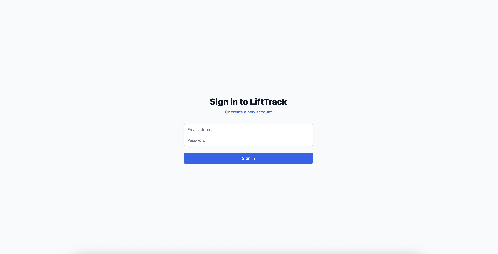
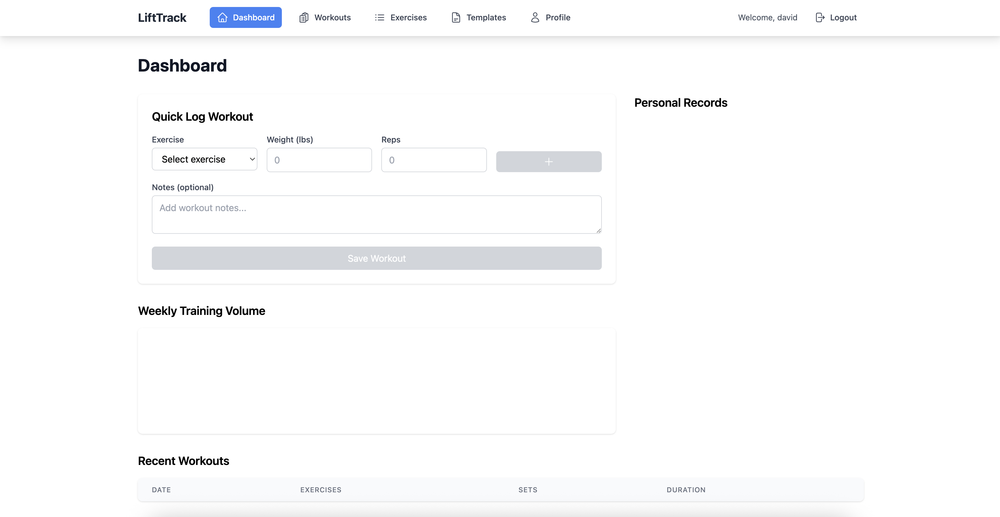
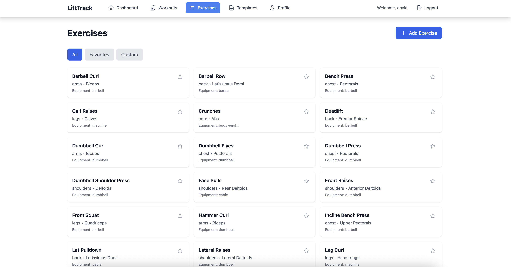
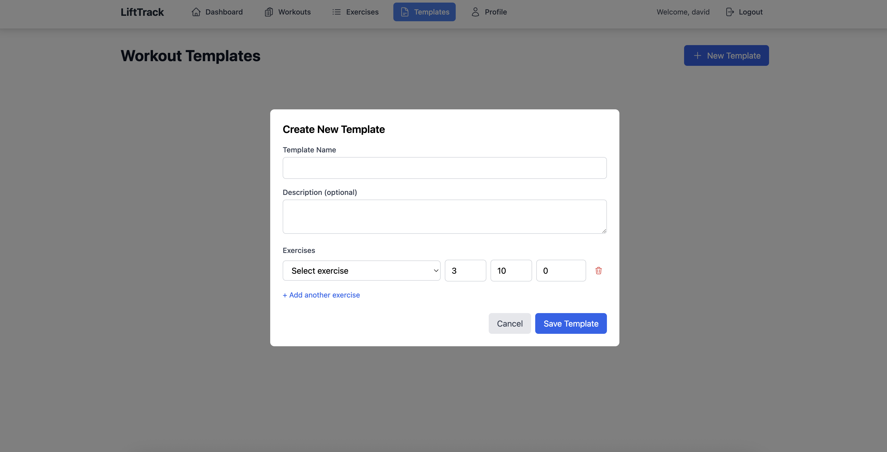

# LiftTrack

A minimal, web-first workout tracker. Log sets in seconds and view simple charts for weekly volume and estimated 1RM. No ads or social feeds.

## Demo Video

[Watch Demo Video (1:45)](YOUR_YOUTUBE_LINK_HERE)

## Screenshots

### Login & Authentication

*Clean authentication interface with form validation*

### Dashboard - Quick Workout Logging & D3 Charts

*Main dashboard showing QuickLog panel and D3 volume visualization*

### Exercise Management

*Exercise library with favorites and custom exercise creation*

### Workout History

*Complete workout history with detailed view and CSV export*

### Workout Templates

*Create and manage reusable workout templates*

## Features

✅ **Quick Workout Logging** - Log sets with exercise, weight, and reps in under a minute  
✅ **Progress Visualization** - D3-powered charts for weekly training volume and PR tracking  
✅ **Exercise Management** - Star favorites, create custom exercises, filter by category  
✅ **Workout Templates** - Create and reuse workout templates for consistent training  
✅ **Responsive Design** - Works seamlessly on mobile and desktop  
✅ **CSV Export** - Export workout history for external analysis  
✅ **JWT Authentication** - Secure user accounts with token-based auth

## Technology Stack

### Frontend
- React with TypeScript
- Tailwind CSS for responsive styling
- D3.js for data visualization
- React Router for navigation
- Axios for API calls

### Backend
- Node.js with Express
- MongoDB with Mongoose ODM
- JWT for authentication
- bcrypt for password hashing
- Express Validator for input validation

## Installation

### Prerequisites
- Node.js (v14 or higher)
- MongoDB (local or cloud instance)
- npm or yarn

### Setup Instructions

1. Clone the repository
```bash
git clone https://github.com/DavNquyen/LiftTrack.git
cd LiftTrack
```

2. Install backend dependencies
```bash
cd backend
npm install
```

3. Configure environment variables
Create a `.env` file in the backend directory:
```
PORT=5000
MONGODB_URI=mongodb://localhost:27017/lifttrack
JWT_SECRET=your-secret-key-change-this-in-production
NODE_ENV=development
```

4. Seed exercise data (optional)
```bash
node seedExercises.js
```

5. Start the backend server
```bash
npm run dev
```

6. Install frontend dependencies (new terminal)
```bash
cd ../frontend
npm install
```

7. Start the frontend development server
```bash
npm start
```

8. Open your browser and navigate to `http://localhost:3000`

## Usage

### Getting Started
1. Create an account or login
2. Add exercises or use the pre-seeded ones
3. Log workouts using the Quick Log panel on the dashboard
4. View your progress through charts and personal records
5. Create templates for recurring workouts

### Key Features Demo

#### Quick Workout Logging
- Navigate to Dashboard
- Select exercise from dropdown
- Enter weight and reps
- Click "+" to add set
- Click "Save Workout" when done

#### Progress Tracking
- Dashboard shows weekly volume chart
- Personal records display estimated 1RM
- Workouts page shows detailed history

#### Templates
- Create templates with pre-defined exercises and sets
- Use templates to quickly start workouts
- Manage and edit templates as needed

## API Endpoints

### Authentication
- `POST /api/auth/signup` - Create new account
- `POST /api/auth/login` - Login user

### Exercises
- `GET /api/exercises` - Get all exercises
- `POST /api/exercises` - Create custom exercise
- `PATCH /api/exercises/:id/favorite` - Toggle favorite status

### Workouts
- `GET /api/workouts` - Get user's workouts
- `POST /api/workouts` - Log new workout
- `GET /api/workouts/stats/volume` - Get volume statistics
- `GET /api/workouts/stats/pr` - Get personal records

### Templates
- `GET /api/templates` - Get user's templates
- `POST /api/templates` - Create new template
- `POST /api/templates/:id/use` - Use template for workout

## Project Structure

```
LiftTrack/
├── backend/
│   ├── models/         # Mongoose schemas
│   ├── routes/         # API routes
│   ├── middleware/     # Auth middleware
│   └── server.js       # Express server
├── frontend/
│   ├── src/
│   │   ├── components/ # React components
│   │   ├── pages/      # Page components
│   │   ├── hooks/      # Custom React hooks
│   │   ├── services/   # API service
│   │   └── types/      # TypeScript types
│   └── public/
└── README.md
```

## Future Development Roadmap

- [ ] Social features (share workouts, follow users)
- [ ] Advanced analytics (muscle group balance, fatigue tracking)
- [ ] Mobile app (React Native)
- [ ] Workout timer and rest periods
- [ ] Exercise video tutorials
- [ ] Integration with wearables
- [ ] AI-powered workout suggestions
- [ ] Nutrition tracking

## Known Issues

- Charts may not render properly on very small screens
- CSV export may have formatting issues with special characters
- Template deletion is soft delete only

## Contributing

Contributions are welcome! Please feel free to submit a Pull Request.

## License

MIT License

## Contact

David Nguyen - [GitHub](https://github.com/DavNquyen)

Project Link: [https://github.com/DavNquyen/LiftTrack](https://github.com/DavNquyen/LiftTrack)